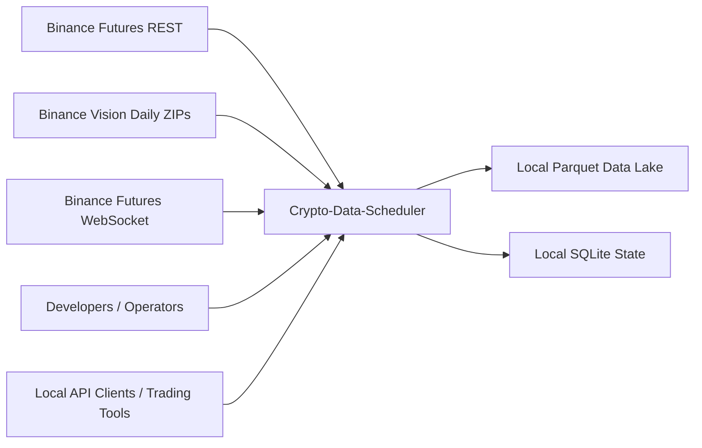
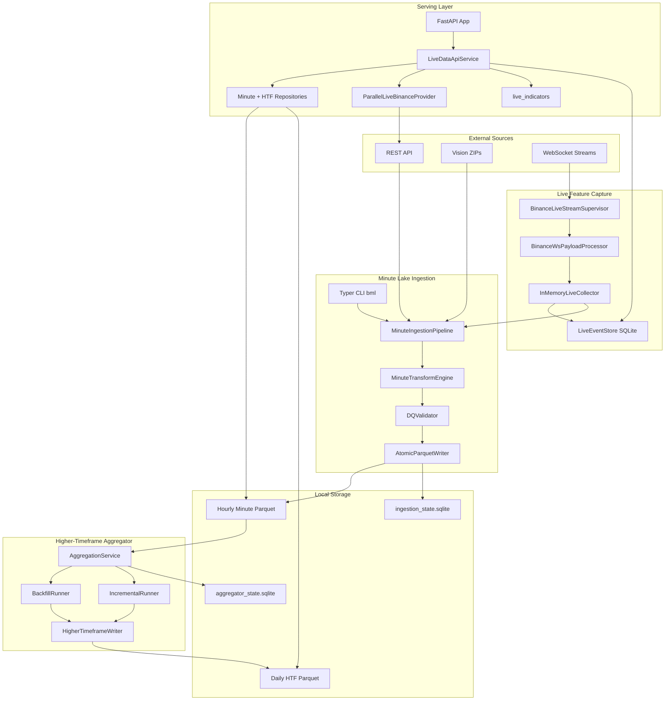
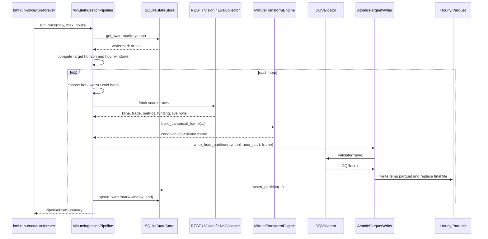
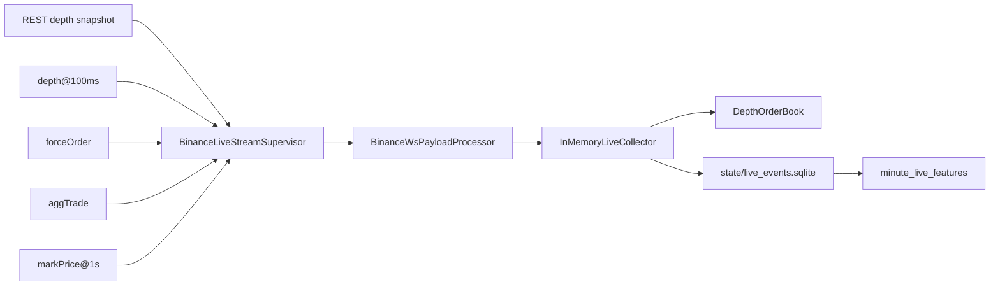
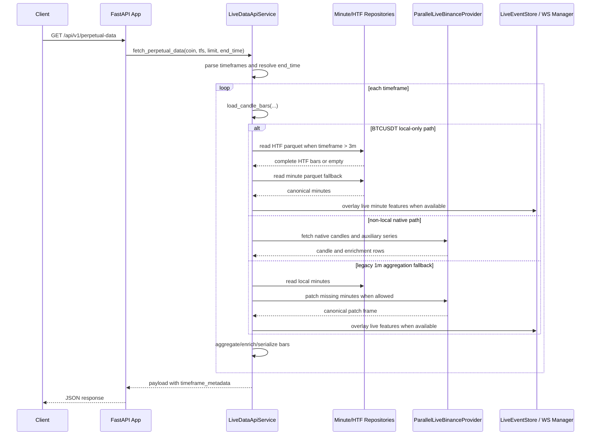
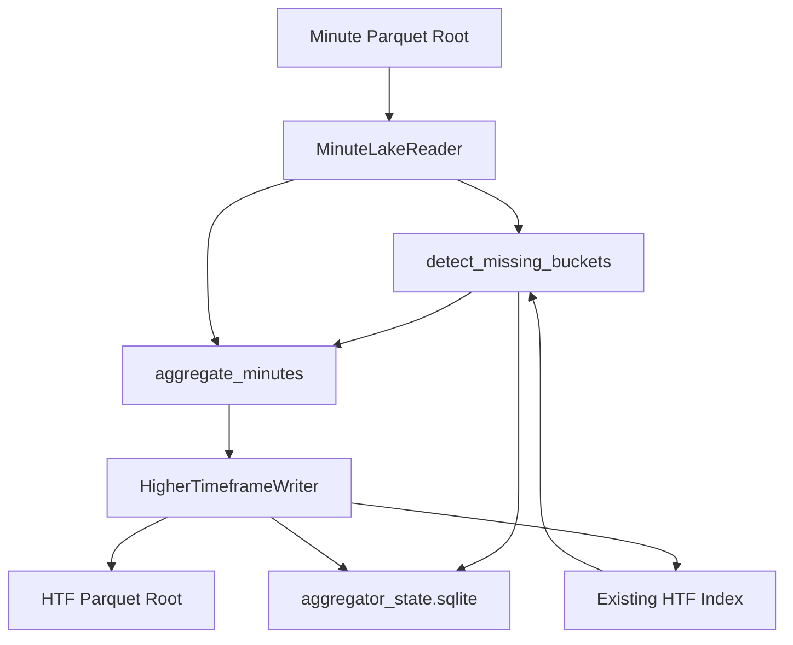
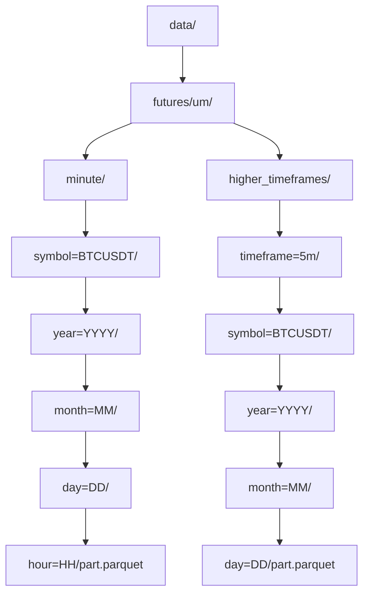
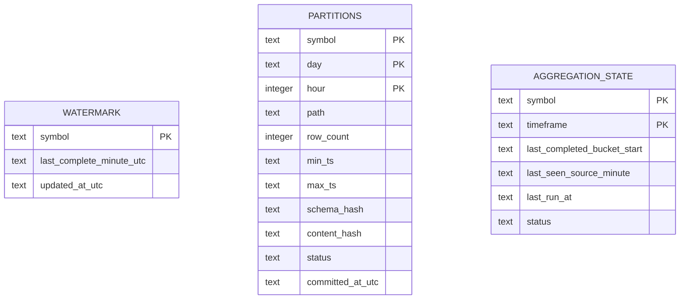
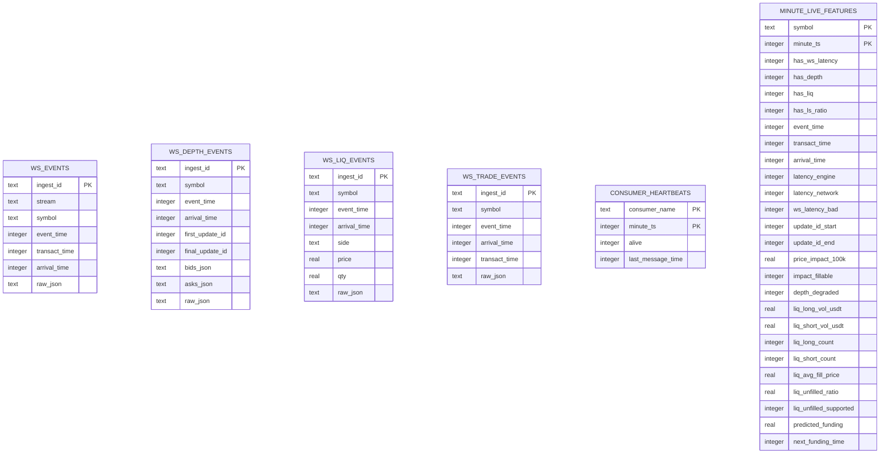

# Architecture Diagrams

These diagrams describe the repository as implemented today. Labels use the same convention as the HLD and LLD: observed, inferred, and unclear / needs confirmation.

## 1. System Context

**Observed**

## 2. Container View

**Observed**

## 3. Minute Ingestion Sequence

**Observed**

## 4. WebSocket Live Feature Flow

**Observed**

## 5. Live Data API Request Flow

**Observed**

## 6. Higher-Timeframe Aggregator Flow

**Observed**

## 7. Data Lake Layout

**Observed**

## 8. SQLite State Model

**Observed**

## 9. Live Event Store Model

**Observed**

